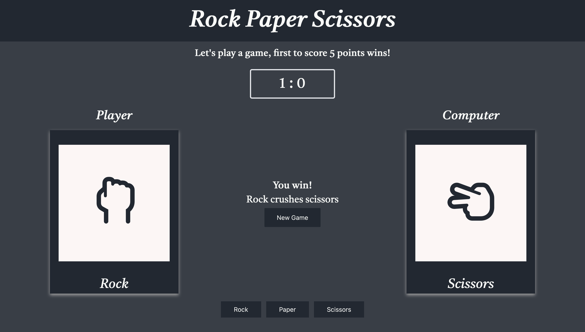

# Rock Paper Scissors

This is a revision of my rock, paper, scissors project. The previous version of the program was only accessible through the  browser’s console tab, but I am happy to share that it now has a graphical user interface!
 
## Overview

As a continuation of my journey through the Odin Project Foundations curriculum I have been tasked with adding a graphical user interface to my previous iteration of rock, paper, scissors. The JavaScript portion of this project remained largely unchanged, but I did make a few changes as listed below.  

Users should now be able to:

- Play a match until either the player or the computer reaches 5 points
- Use buttons to select rock, paper or scissors
- See corresponding icons & text for player and computer selections 
- View the results of the current round and track the current leader with the up-to-date scoreboard

### Screenshot



### What I learned

After completing this project I am feeling a bit more comfortable with JavaScript. I learned how to use arrays to store multiple strings in a single variable.  

Used here:

```
function getComputerChoice() {
  const choices = ['rock', 'paper', 'scissors'];
  const randomNumber = Math.floor(Math.random() * 3);
  return choices[randomNumber];
}

```
I also learn how to manipulate the DOM, using query selectors. With this tool I was able to select and modify elements by adding event listeners and changing text whenever a particular button was pressed.
 
### Continued development

My goals going forward: 

- Continue to work towards optimizing designs so that they are responsive and viewable on all screens
- Work on keeping code clean and readable
- Test and Refactor code to limit redundancy	
- Build problem solving skills, by executing ideas step by step with pseudocode 

### Links

- GitHub Repo: 

